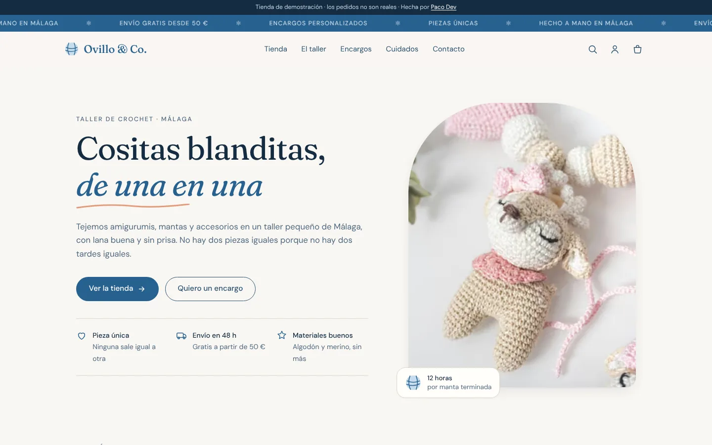
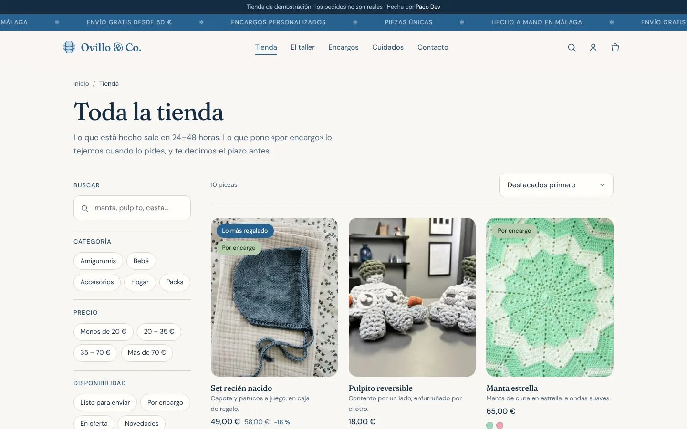
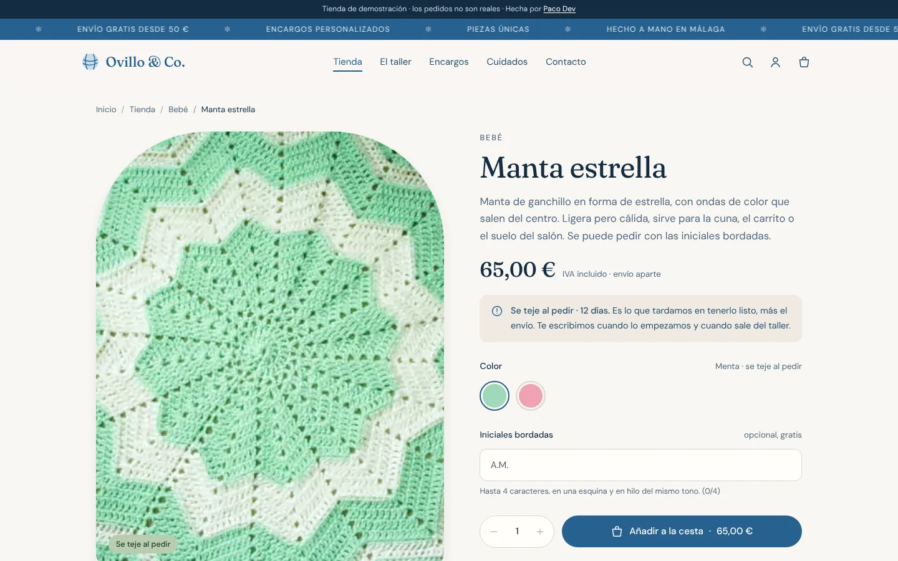
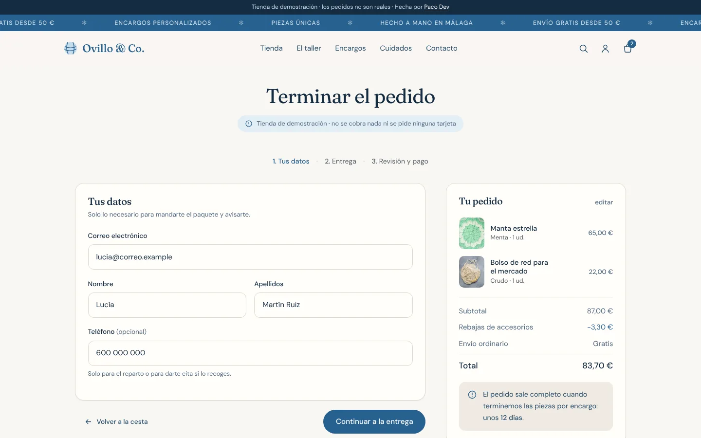
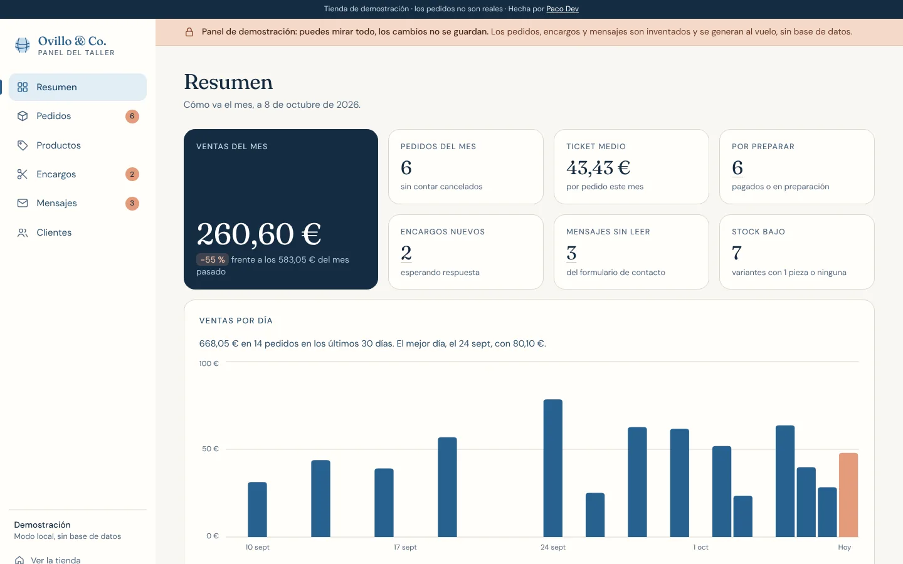
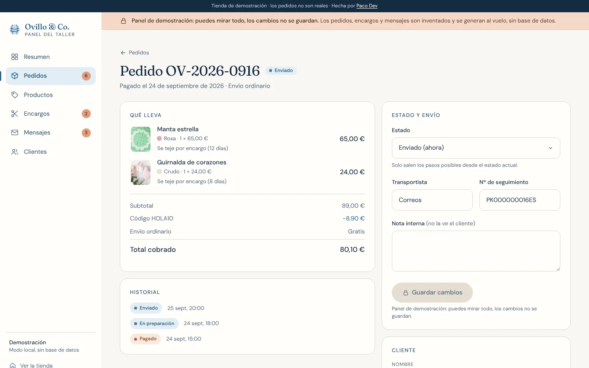
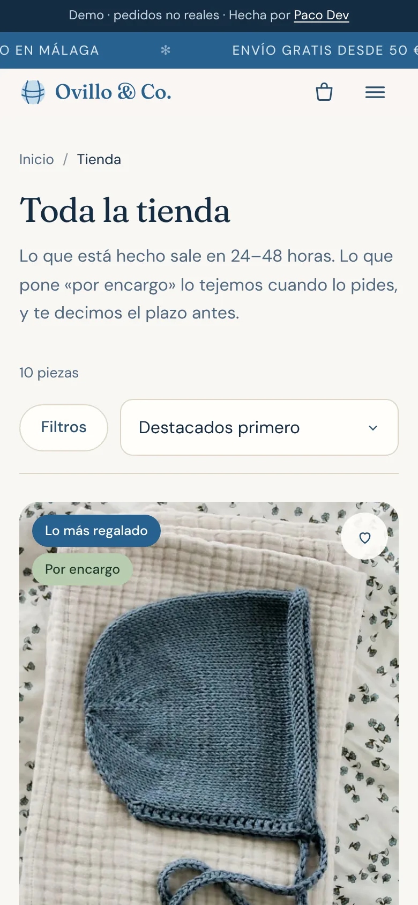

<p align="center">
  
</p>

<h1 align="center">Ovillo &amp; Co.</h1>

<p align="center">
  <strong>Tienda online de demostración de un taller de crochet, hecha de principio a fin:</strong><br>
  catálogo, pago, cuentas y panel del dueño.
</p>

<p align="center">
  <a href="https://github.com/soypacodev/ovillo-co/actions/workflows/ci.yml"></a>
  <a href="LICENSE"></a>
  
  
  
  
</p>

<p align="center">
  <a href="https://ovillo-co.vercel.app"><strong>Ver la demo online</strong></a> ·
  <a href="#qué-incluye">Qué incluye</a> ·
  <a href="#seguridad">Seguridad</a> ·
  <a href="#ejecutarlo-en-local">Ejecutarlo en local</a> ·
  <a href="docs/ARQUITECTURA.md">Arquitectura</a> ·
  <a href="docs/DESPLIEGUE.md">Despliegue</a>
</p>

<p align="center">
  
</p>

> **Es una tienda ficticia.** Ovillo &amp; Co. no existe: el taller, los productos, los pedidos y las reseñas son de ejemplo. El pago funciona de verdad, pero siempre con Stripe en **modo prueba**: nunca se cobra ni se pide una tarjeta real. Sirve para enseñar cómo quedaría una tienda así, terminada y lista para un negocio pequeño.

---

## Qué incluye

Todo lo que necesita un taller o una tienda pequeña para vender por internet sin depender de una plataforma de terceros.

| Para quien compra | Para quien vende |
|---|---|
| **Catálogo** con filtros por categoría, precio y disponibilidad, buscador y fichas con varias fotos y colores | **Panel del taller** con las ventas del mes, el ticket medio, lo que hay que preparar y el stock que se acaba |
| **Piezas por encargo** con su plazo de confección y personalización (iniciales bordadas, por ejemplo) | **Pedidos** con su historial: pagado → en preparación → enviado → entregado, con transportista y número de seguimiento |
| **Cesta** que se guarda sola, se sincroniza entre pestañas y avisa si cambia un precio o se agota algo | **Productos**: alta y edición con variantes, precios, rebajas, fotos y estado (borrador, publicado, archivado) |
| **Pago seguro** con Stripe, cupones, rebajas automáticas y envío gratis a partir de un importe | **Encargos y mensajes** del formulario de contacto, con las fotos de referencia que manda la clientela |
| **Cuenta** con pedidos, seguimiento, direcciones y favoritos | **Clientes** deducidos de los pedidos, también los que compran sin cuenta |
| **Formulario de encargos** con fotos de referencia, y lista de espera para las piezas agotadas | **Modo demostración** del panel: cualquiera puede verlo entero, nadie puede cambiar nada |

Y lo que no se ve, pero se nota: carga rápida en móvil, textos accesibles para lectores de pantalla, uso completo con teclado y páginas preparadas para buscadores y para compartir en redes.

<table>
  <tr>
    <td width="50%"></td>
    <td width="50%"></td>
  </tr>
  <tr>
    <td align="center"><sub>Catálogo con filtros</sub></td>
    <td align="center"><sub>Ficha de producto</sub></td>
  </tr>
  <tr>
    <td width="50%"></td>
    <td width="50%"></td>
  </tr>
  <tr>
    <td align="center"><sub>Pago en tres pasos</sub></td>
    <td align="center"><sub>Panel del taller: resumen</sub></td>
  </tr>
  <tr>
    <td width="50%"></td>
    <td width="50%" align="center"></td>
  </tr>
  <tr>
    <td align="center"><sub>Panel del taller: un pedido</sub></td>
    <td align="center"><sub>En el móvil</sub></td>
  </tr>
</table>

### Pruébalo

- **Compra algo.** Sin Stripe configurado, la tienda crea un pedido de demostración sin pasar por ninguna pasarela. Con Stripe en modo prueba, usa la tarjeta `4242 4242 4242 4242`, cualquier fecha futura y cualquier CVC.
- **Entra en el panel.** El botón *Ver el panel de demostración* del pie abre el panel con una cuenta de solo lectura y 25 pedidos, 6 encargos y 7 mensajes inventados.
- **Usa un cupón.** `HOLA10` descuenta un 10 % a partir de 15 €; `ENVIOGRATIS` quita el envío a partir de 30 €.

---

## Cómo está hecho

| Pieza | Qué se usa | Por qué |
|---|---|---|
| Aplicación | **Next.js 16** (App Router) y **React 19** | Componentes de servidor por defecto: casi todo se pinta en el servidor y al navegador solo llega el JavaScript de lo interactivo (cesta, filtros, formularios) |
| Lenguaje | **TypeScript** en modo estricto, sin `any` | Los tipos del catálogo, la cesta y los pedidos son los mismos en la tienda, el pago y el panel |
| Validación | **Zod** | Todo lo que llega del navegador (formularios, cesta, pedido) se valida en el servidor antes de usarse |
| Datos y cuentas | **Supabase**: PostgreSQL, Auth y Storage | La seguridad vive en la base de datos (RLS), no en el front, y los cálculos de dinero también |
| Pagos | **Stripe Checkout** en modo prueba | El cobro ocurre en la página de Stripe: la tienda nunca ve una tarjeta |
| Estilos | **CSS propio** con variables de diseño | Sin framework de estilos: menos peso y control total del diseño |
| Tipografía | Fraunces y DM Sans **servidas desde el propio dominio** | Recortadas a lo que usa la web: pasan de 325 KB a 80 KB |
| Pruebas | **Vitest**, **Playwright** con **axe-core** y PostgreSQL real | Lógica, interfaz, accesibilidad y políticas de la base de datos, en cada push |
| Despliegue | **Vercel**, con las funciones en París | Previsualización por rama y dominio con HTTPS sin configurar servidores; la región, fijada en [`vercel.json`](vercel.json), es la más cercana a España |

**Funciona sin nada configurado.** Sin variables de entorno, el catálogo sale de [`src/datos/semilla.ts`](src/datos/semilla.ts), el pago crea pedidos de demostración y el panel enseña datos inventados generados al vuelo. Con Supabase y Stripe, la misma interfaz pasa a leer y escribir de verdad. Cómo se consigue está en [`docs/ARQUITECTURA.md`](docs/ARQUITECTURA.md).

---

## Seguridad

La clave pública de Supabase viaja en el navegador y cualquiera puede leerla, y una acción de servidor es, al final, un `POST` que cualquiera puede lanzar. Por eso nada importante depende de lo que haga el navegador.

**Base de datos**

- **RLS en todas las tablas** ([`supabase/migrations/…_seguridad.sql`](supabase/migrations/20261008120100_seguridad.sql)). El catálogo publicado lo lee cualquiera; perfiles, direcciones, favoritos y pedidos, solo su dueño; el catálogo solo lo escribe admin. Además se retiran `TRUNCATE`, `REFERENCES` y `TRIGGER` a los roles públicos, que RLS no cubre.
- **Los pedidos no se crean desde fuera.** Solo los registra el servidor con el rol de servicio, después de que Stripe confirme el cobro, mediante [`registrar_pedido_pagado()`](supabase/migrations/20261008120200_funciones.sql), en una única transacción. Admin puede cambiar el estado y los datos de envío, nunca los importes.
- **Stock sin carreras.** El descuento es una actualización condicionada que bloquea la fila: una prueba lanza **8 compras simultáneas de la última pieza** y comprueba que solo sale una.
- **Los cupones no se pueden listar.** Solo se comprueban de uno en uno con `buscar_cupon()`; los formularios del boletín y de avisos responden igual tanto si el correo ya estaba como si no.
- **Nadie se asciende a admin.** El rol no se puede cambiar desde la API; [`asignar_rol()`](supabase/migrations/20261009120100_panel.sql) solo se ejecuta desde el editor SQL de Supabase y se niega a dejar la tienda sin ningún admin.
- **Rol `demo` de solo lectura.** Políticas *restrictivas* (que ninguna otra puede abrir) le impiden escribir en cualquier tabla o subir archivos, y las funciones del panel le devuelven los datos personales reales enmascarados (`l•••@g•••.com`, `L. G. P.`, solo la ciudad de la dirección).
- **Probado sobre PostgreSQL real.** [`npm run db:probar`](scripts/probar-bd.sh) aplica las migraciones en un PostgreSQL temporal y ejecuta más de 200 comprobaciones de [`supabase/pruebas/`](supabase/pruebas/): qué puede leer y escribir cada rol, la carrera por el stock y el panel.

**Pago**

- **Recálculo en el servidor.** Del navegador solo se acepta qué pieza, qué color, cuántas unidades y la personalización. El precio se recalcula con el catálogo ([`src/lib/pagos/recalculo.ts`](src/lib/pagos/recalculo.ts) y `calcular_pedido()` en la base de datos) y, si el total no coincide con el que vio la clienta, el pago no se abre ([`src/lib/pagos/acciones.ts`](src/lib/pagos/acciones.ts)).
- **Webhook verificado e idempotente** ([`src/lib/pagos/webhook.ts`](src/lib/pagos/webhook.ts)). Se comprueba la firma de Stripe sobre el cuerpo exacto; cada evento se anota en `eventos_stripe` y la sesión de pago es única, así que un reintento no duplica el pedido. Si un pedido cobrado no se puede servir (por ejemplo, se agotó entre medias), se reembolsa automáticamente con clave de idempotencia para no devolver el dinero dos veces.
- **Solo claves de prueba.** Solo una clave `sk_test_…` completa activa Stripe; una real o a medio rellenar deja la tienda en modo demostración ([`src/lib/datos/entorno-servidor.ts`](src/lib/datos/entorno-servidor.ts)).

**Navegador y servidor**

- **CSP con nonce por petición** ([`src/proxy.ts`](src/proxy.ts) y [`src/lib/seguridad/csp.ts`](src/lib/seguridad/csp.ts)): solo se ejecutan los scripts firmados con el nonce de esa respuesta (`'strict-dynamic'`, sin `'unsafe-inline'` ni `'unsafe-eval'` en producción), `frame-ancestors 'none'`, `object-src 'none'` y formularios solo hacia la propia web y Stripe Checkout.
- **Cabeceras fijas** en [`next.config.ts`](next.config.ts): HSTS de dos años, `X-Content-Type-Options: nosniff`, `Referrer-Policy` que no filtra rutas con números de pedido, `Permissions-Policy` que apaga cámara, micrófono y ubicación, `X-Frame-Options: DENY` y `Cross-Origin-Opener-Policy`. Sin cabecera `X-Powered-By`.
- **Secretos aislados.** La clave de servicio y las de Stripe solo se leen en módulos marcados con `server-only`: importarlos desde un componente de cliente rompe la compilación.
- **Formularios con freno.** Límite de envíos por origen en contacto, encargos, cuentas y pago, y campo trampa contra bots en los formularios públicos; los mensajes de contacto y los encargos se registran con funciones que solo puede llamar el servidor, así que esas protecciones no se saltan llamando a la API.
- **Redirecciones seguras.** Los parámetros `?siguiente=` solo admiten rutas internas ([`src/lib/cuentas/redireccion.ts`](src/lib/cuentas/redireccion.ts)) y las fotos de los encargos viven en un bucket privado que se lee con URL firmada.

Para avisar de un fallo, sigue [`SECURITY.md`](SECURITY.md).

---

## Calidad

| Qué | Cómo | Dónde |
|---|---|---|
| Lógica | Más de 170 pruebas de Vitest: totales, cupones, cesta guardada, recálculo del pedido, webhook, esquemas, permisos del panel | `src/**/*.test.ts` |
| Base de datos | Migraciones, semilla y más de 200 comprobaciones de RLS, funciones y concurrencia sobre PostgreSQL 16 | [`supabase/pruebas/`](supabase/pruebas/) |
| Extremo a extremo | Playwright en escritorio y en móvil contra la compilación de producción | [`e2e/`](e2e/) |
| Accesibilidad | axe-core en las páginas de cuenta y en todas las del panel: ningún fallo grave o crítico permitido | [`e2e/`](e2e/) |
| Tipos y estilo | `tsc` estricto y ESLint con las reglas de Next.js, sin avisos | [`eslint.config.mjs`](eslint.config.mjs) |
| Integración continua | Todo lo anterior y `next build` en cada push y cada PR | [`.github/workflows/ci.yml`](.github/workflows/ci.yml) |

**Accesibilidad (WCAG 2.1 AA).** Foco visible en todo, navegación completa con teclado, etiquetas en cada campo, resumen de errores que recibe el foco al enviar, anuncios con `aria-live` al añadir a la cesta o aplicar un cupón, zonas táctiles de al menos 44 px y animaciones que se apagan con `prefers-reduced-motion`.

**Lighthouse** (compilación de producción, sin base de datos):

| Página | Rendimiento (móvil · escritorio) | Accesibilidad | Buenas prácticas |
|---|---|---|---|
| Portada | 91 · 99 | 100 | 100 |
| Tienda | 94 · 88 | 100 | 100 |
| Ficha de producto | 88 · 100 | 100 | 100 |
| Pago | 92 · 100 | 100 | 96 |
| Panel | 91 · 100 | 100 | 100 |

La categoría SEO no aparece porque la demo solo deja indexar la portada, que se presenta como demostración, y el resto lleva `noindex` a propósito para no competir con tiendas de crochet de verdad; `NEXT_PUBLIC_INDEXAR=si` abre la tienda entera. Las fotos se sirven en AVIF o WebP con el tamaño justo para cada pantalla.

---

## Estructura

```
src/
├── app/
│   ├── (tienda)/        portada, catálogo, ficha, cesta, pago, cuenta y páginas de contenido
│   ├── panel/           panel del taller: resumen, pedidos, productos, encargos, mensajes, clientes
│   ├── api/stripe/      webhook de Stripe
│   └── auth/confirmar/  vuelta de los enlaces de los correos de Supabase Auth
├── componentes/         interfaz, agrupada por zona (catálogo, cesta, compra, cuenta, panel…)
├── lib/
│   ├── datos/           acceso al catálogo: semilla local o Supabase, con la misma interfaz
│   ├── cesta/           cesta, totales, cupones y favoritos (lógica pura, probada)
│   ├── pagos/           confirmación del pedido, Stripe, recálculo y webhook
│   ├── panel/           acceso por rol y datos del panel (Supabase o demostración local)
│   ├── cuentas/         sesión, registro, entrada y acciones de la cuenta
│   ├── acciones/        formularios públicos: contacto, encargos, boletín, avisos de stock
│   └── seguridad/       política de seguridad de contenido
├── datos/               catálogo de ejemplo (semilla) y datos del taller
├── estilos/             CSS por zona sobre variables de diseño
├── fuentes/             Fraunces y DM Sans recortadas, con su licencia
└── proxy.ts             nonce y CSP por petición, sesión y zonas privadas
supabase/
├── migrations/          esquema, RLS, funciones, almacenamiento y panel
├── pruebas/             pruebas de seguridad en SQL
├── seed.sql             catálogo (generado desde src/datos/semilla.ts)
└── seed-demo.sql        pedidos, encargos y mensajes ficticios para el panel
scripts/                 generador de la semilla y prueba de la base de datos
e2e/                     pruebas de Playwright
docs/                    arquitectura, despliegue, créditos y capturas
```

---

## Ejecutarlo en local

Necesitas **Node.js 22.18 o superior** (los scripts de la base de datos cargan TypeScript directamente).

```bash
git clone https://github.com/soypacodev/ovillo-co.git && cd ovillo-co
npm ci
npm run dev
```

Abre <http://localhost:3000>. **No hace falta ninguna clave:** sin variables de entorno la tienda funciona entera en modo demostración, con el catálogo de ejemplo, pedidos de prueba y el panel en solo lectura. No copies `.env.example` hasta que vayas a conectar algo.

<details>
<summary><strong>Todos los comandos</strong></summary>

<br>

| Comando | Qué hace |
|---|---|
| `npm run dev` | Servidor de desarrollo |
| `npm run build` · `npm start` | Compilación de producción y servidor |
| `npm run lint` | ESLint |
| `npm test` | Pruebas de Vitest |
| `npm run test:e2e` | Pruebas de Playwright (arranca su propio servidor; con `E2E_URL` usa uno ya levantado) |
| `npm run db:probar` | Prueba la base de datos en un PostgreSQL temporal (necesita PostgreSQL 15 o superior instalado; sin Docker ni cuenta de Supabase) |
| `npm run db:semilla` | Regenera `supabase/seed.sql` a partir de `src/datos/semilla.ts` |

</details>

## Conectarlo de verdad

Para que los pedidos, las cuentas y el panel guarden datos hacen falta tres servicios, los tres con plan gratuito:

1. **Supabase**: base de datos, cuentas y fotos.
2. **Stripe** en modo prueba: el pago.
3. **Vercel**: la web publicada con su dominio.

La guía paso a paso, pensada para quien no lo ha hecho nunca, está en [**`docs/DESPLIEGUE.md`**](docs/DESPLIEGUE.md). Cada variable de entorno está explicada también en [`.env.example`](.env.example).

---

## Créditos

Las fotos son de fotógrafas y fotógrafos de [Unsplash](https://unsplash.com) y las fuentes, Fraunces y DM Sans, tienen licencia OFL. La lista completa, con enlace a cada autor, está en [`docs/CREDITOS.md`](docs/CREDITOS.md).

## Licencia

El código se publica bajo licencia [MIT](LICENSE): puedes usarlo, modificarlo y distribuirlo libremente conservando el aviso de copyright.

**Las fotos no entran en la licencia MIT.** Son de sus autores y se usan con la [licencia de Unsplash](https://unsplash.com/license); si reutilizas el proyecto, cámbialas por las tuyas o respeta esa licencia. Las fuentes conservan su propia licencia OFL, incluida junto a los archivos.

## ¿Quieres algo así?

Ovillo &amp; Co. es una demostración hecha por **Paco López · Paco Dev**, desarrollador full stack en Málaga, para enseñar lo que puede tener un negocio pequeño: esta misma tienda, con tu catálogo, tus fotos y tus envíos. La web publicada lo dice en una cinta discreta arriba y en el pie, sin estorbar a quien solo quiere ver la tienda.

Escríbeme a **[soypacodev@gmail.com](mailto:soypacodev@gmail.com?subject=Quiero%20una%20tienda%20como%20Ovillo%20%26%20Co.)** y lo hablamos.

[GitHub](https://github.com/soypacodev) · [Instagram @soypacodev](https://www.instagram.com/soypacodev/)

<p align="center"><sub>Hecha en Málaga por <a href="https://github.com/soypacodev">Paco López</a>.</sub></p>
