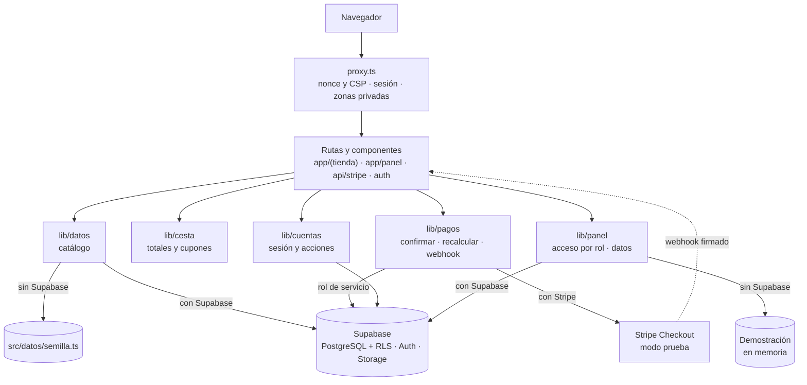
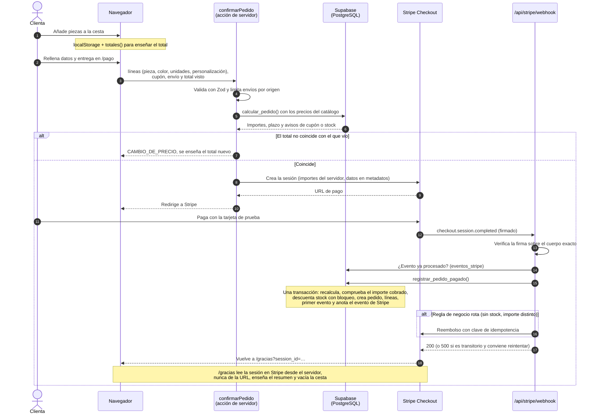
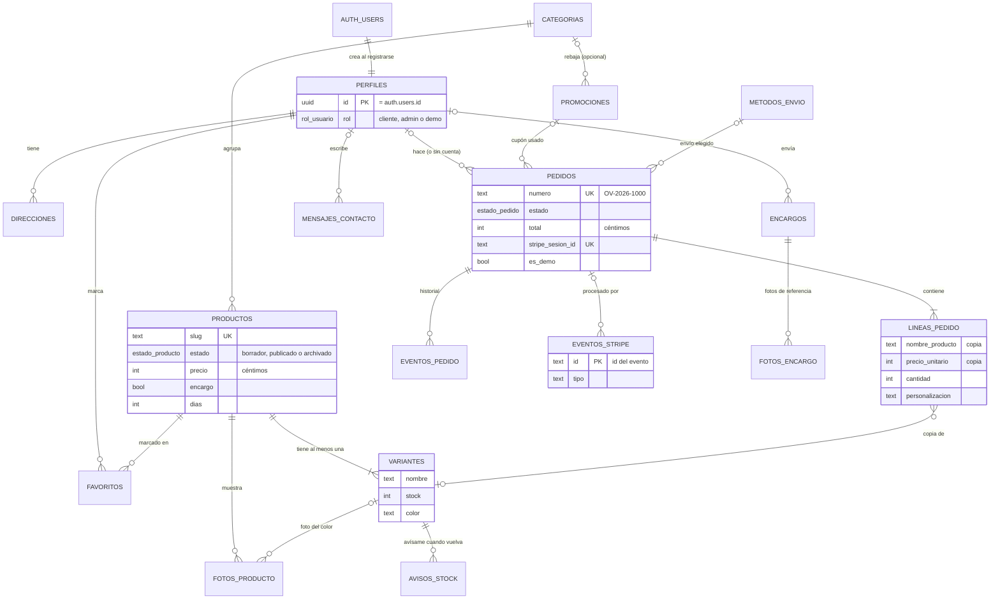

# Arquitectura

Cómo está organizada la tienda, qué hace cada capa, cómo viaja un pedido desde la cesta hasta el panel y por qué se tomaron las decisiones menos evidentes.

**Índice**

1. [Vista general](#1-vista-general)
2. [Capas](#2-capas)
3. [Un pedido de principio a fin](#3-un-pedido-de-principio-a-fin)
4. [Modelo de datos](#4-modelo-de-datos)
5. [Decisiones y por qué](#5-decisiones-y-por-qué)

---

## 1. Vista general

Una sola aplicación **Next.js 16** (App Router) con dos caras: la tienda y el panel del taller. Debajo, **Supabase** (PostgreSQL, Auth y Storage) y **Stripe Checkout**. Las dos dependencias externas son opcionales: sin ellas, cada capa tiene una alternativa local y la web funciona entera en modo demostración.

La regla general: **la interfaz no sabe de dónde salen los datos.** Las páginas hablan con una interfaz (`FuenteCatalogo`, `FuentePanel`) y una función elige la implementación según las variables de entorno.

## 2. Capas

### Rutas: `src/app/`

| Zona | Qué hay | Notas |
|---|---|---|
| `(tienda)/` | Portada, catálogo, ficha, cesta, pago, gracias, cuenta, encargos, contenido | Grupo de rutas: comparte la cabecera, el pie y la cinta de demostración sin añadir un segmento a la URL |
| `panel/` | Resumen, pedidos, productos, encargos, mensajes, clientes | Cada página comprueba el rol por sí misma: el layout no se vuelve a pintar al navegar entre páginas |
| `api/stripe/webhook/` | Único endpoint de API | Lee el cuerpo como texto para verificar la firma |
| `auth/confirmar/` | Vuelta de los enlaces de los correos | Admite `?code=` (PKCE) y `?token_hash=&type=` |
| `sitemap.ts`, `robots.ts`, `manifest.ts`, `opengraph-image.tsx` | Metadatos generados | La imagen para redes se genera con la tipografía de la marca; cada ficha tiene la suya en `tienda/[slug]/opengraph-image.tsx` |

Las páginas son **componentes de servidor**: leen los datos, los pasan ya resueltos y solo hidratan las islas interactivas. Los `params` y `searchParams` son promesas (Next 16) y se leen con [`src/lib/parametros.ts`](../src/lib/parametros.ts), que tiene en cuenta que cada valor puede venir repetido.

### Componentes: `src/componentes/`

Agrupados por zona (`catalogo/`, `cesta/`, `compra/`, `cuenta/`, `panel/`, `marco/`, `formularios/`…). Solo llevan `'use client'` los que necesitan estado o eventos: la cesta, los filtros, la galería, los formularios y las animaciones de aparición. Los iconos son SVG en línea, decorativos por defecto (`aria-hidden`): el nombre accesible lo pone siempre el botón o el enlace.

### Datos del catálogo: `src/lib/datos/`

- [`fuente.ts`](../src/lib/datos/fuente.ts) define `FuenteCatalogo`: categorías, productos con filtros, ficha, relacionados, promociones, cupón y métodos de envío.
- [`fuente-semilla.ts`](../src/lib/datos/fuente-semilla.ts) responde con [`src/datos/semilla.ts`](../src/datos/semilla.ts), en memoria y sin red.
- [`fuente-supabase.ts`](../src/lib/datos/fuente-supabase.ts) lee de Supabase con la clave pública; RLS solo le deja ver lo publicado. Los filtros sencillos viajan a la base de datos y el orden final usa **las mismas funciones puras** que la semilla, para que los dos orígenes respondan igual.
- [`index.ts`](../src/lib/datos/index.ts) elige: con `NEXT_PUBLIC_SUPABASE_URL` y `NEXT_PUBLIC_SUPABASE_ANON_KEY`, Supabase; sin ellas, la semilla.
- [`entorno.ts`](../src/lib/datos/entorno.ts) y [`entorno-servidor.ts`](../src/lib/datos/entorno-servidor.ts) validan las variables con Zod una sola vez. El segundo lleva `import 'server-only'`: importarlo desde el cliente rompe la compilación.
- `supabase/` crea los cuatro clientes: público (anónimo), de servidor (con la sesión de la cookie), de navegador y de servicio (se salta RLS; solo webhook y altas del servidor).

### Cesta: `src/lib/cesta/`

- **Lógica pura y probada**: [`totales.ts`](../src/lib/cesta/totales.ts) es el único sitio con aritmética de dinero. Orden: subtotal → rebaja automática por categoría → cupón sobre lo que queda → envío. El envío gratis se mide con lo que se paga por las piezas después de rebajas y cupón; si un código deja la cesta por debajo del umbral, la cesta lo avisa («Con este código te faltan X € para el envío gratis»). La rebaja automática se redondea por unidad y la tienda enseña ya el precio final ([`precio.ts`](../src/lib/catalogo/precio.ts)) en tarjetas, ficha, botón de añadir y datos estructurados, así que lo que se ve es lo que se cobra; `calcular_pedido` en SQL hace la misma cuenta. El cajón, la página de la cesta, el pago, el recálculo del servidor sin Supabase y los datos de demostración del panel llaman a la misma función.
- **Estado**: un almacén externo para `useSyncExternalStore` que vive en memoria, se guarda en `localStorage` y escucha el evento `storage` para que dos pestañas vean la misma cesta.
- **Lo guardado se valida**: lo que hay en `localStorage` puede venir de una versión anterior o estar editado a mano, así que se comprueba campo a campo y lo que no encaja se descarta en lugar de romper la página.
- **Se pone al día con el catálogo**: al cargar el catálogo del servidor, la cesta actualiza precios y avisa de piezas agotadas o retiradas.

### Pagos: `src/lib/pagos/`

| Archivo | Responsabilidad |
|---|---|
| [`acciones.ts`](../src/lib/pagos/acciones.ts) | Acción de servidor `confirmarPedido`: valida, recalcula, compara el total y abre Stripe o crea un pedido de demostración |
| [`recalculo.ts`](../src/lib/pagos/recalculo.ts) | Recalcula con el catálogo: en TypeScript con la semilla o con `calcular_pedido()` en la base de datos. Los dos caminos lanzan los mismos códigos de error |
| [`stripe.ts`](../src/lib/pagos/stripe.ts) | Crea la sesión de Checkout y la lee al volver a `/gracias` |
| [`metadatos.ts`](../src/lib/pagos/metadatos.ts) | Empaqueta en los metadatos de la sesión lo que el webhook necesita, en trozos de 500 caracteres (límite de Stripe) |
| [`webhook.ts`](../src/lib/pagos/webhook.ts) | Qué hacer con cada evento, **sin red ni base de datos**: recibe las dependencias como parámetro y se prueba con dobles |
| [`webhook-servidor.ts`](../src/lib/pagos/webhook-servidor.ts) | Las dependencias reales: firma, base de datos con el rol de servicio y reembolsos |

### Panel: `src/lib/panel/`

- [`acceso.ts`](../src/lib/panel/acceso.ts): quién entra y quién escribe, como lógica pura. Sin base de datos, cualquiera entra en modo local de solo lectura; con base de datos, solo `admin` (escribe) y `demo` (solo lectura).
- [`servidor.ts`](../src/lib/panel/servidor.ts): lo llama cada página y **cada acción de escritura vuelve a comprobar el rol** en el servidor, aunque el botón ya estuviera desactivado. RLS repite la misma regla en la base de datos.
- `FuentePanel` tiene dos implementaciones: [`fuente-supabase.ts`](../src/lib/panel/fuente-supabase.ts), que llama a las funciones `panel_*` con la sesión de quien mira, y [`fuente-local.ts`](../src/lib/panel/fuente-local.ts), que genera en memoria los mismos datos que `seed-demo.sql` y repite los filtros, el orden y las columnas de cada función SQL.

### Proxy: `src/proxy.ts`

En Next 16, `proxy.ts` sustituye a `middleware.ts`. Se ejecuta antes de cada documento HTML (no en estáticos, imágenes, el webhook ni las precargas) y hace cuatro cosas:

1. **Elige el idioma.** `/en/tienda` se sirve con la página de `/tienda` y la cabecera interna `x-idioma: en`; `/es/…` (lo que pide el selector) redirige a la ruta sin prefijo; y una ruta sin prefijo se queda en español salvo que la visita haya elegido otro idioma (cookie) o, la primera vez, su navegador prefiera uno de los nuestros. El panel, `/auth` y la API no se traducen. Ver *Cuatro idiomas sin librería*, más abajo.
2. **Renueva la sesión** de Supabase si ha caducado, y copia las cookies nuevas a la respuesta.
3. **Redirige a `/entrar`** si se pide `/cuenta` o `/panel` sin sesión. Es una comprobación optimista para ahorrarse pintar la página; la de verdad la hacen la propia página y RLS.
4. **Genera un nonce** y la política CSP de esa petición ([`src/lib/seguridad/csp.ts`](../src/lib/seguridad/csp.ts)). Next lee el nonce de la cabecera y lo pone en sus `<script>`; el layout lo pone en el único script en línea propio.

---

## 3. Un pedido de principio a fin

### Con Stripe y Supabase

Después, el pedido aparece en el panel. Cada cambio de estado (pagado → en preparación → enviado → entregado) lo valida el disparador `controlar_estado_pedido()`, que solo deja avanzar por caminos con sentido, sella las fechas y, si se cancela antes de enviarse, devuelve las piezas al stock. Otro disparador anota cada cambio en `eventos_pedido`, que es el seguimiento que ve la clienta en su cuenta.

### Sin Stripe (modo demostración)

Los pasos 1 a 6 son iguales, pero el recálculo usa `calcularConCatalogo()` con la semilla. Si el total coincide, `confirmarPedido` genera una referencia `DEMO-2026-XXXXXX` y devuelve el resumen ya calculado; el navegador lo guarda y `/gracias` lo valida antes de enseñarlo, porque `localStorage` se puede editar. No se cobra, no se guarda nada en el servidor y no se toca el stock.

---

## 4. Modelo de datos

Todas las tablas están en el esquema `public` con RLS activado. El dinero va siempre en **céntimos** (`integer`) y en euros. Los nombres de columna coinciden con los tipos de [`src/lib/catalogo/tipos.ts`](../src/lib/catalogo/tipos.ts) para que el mapeo sea directo.

| Grupo | Tablas | Quién escribe |
|---|---|---|
| Personas | `perfiles`, `direcciones`, `favoritos` | Cada cual lo suyo. El rol, solo `asignar_rol()` desde el editor SQL |
| Catálogo | `categorias`, `productos`, `variantes`, `fotos_producto`, `promociones`, `metodos_envio` | Admin. `panel_guardar_producto()` guarda producto y variantes en una transacción |
| Pedidos | `pedidos`, `lineas_pedido`, `eventos_pedido`, `eventos_stripe` | Solo el servidor con el rol de servicio. Admin cambia estado y datos de envío, nunca importes |
| Formularios | `encargos`, `fotos_encargo`, `mensajes_contacto`, `suscripciones_boletin`, `avisos_stock` | Funciones que valida y llama el servidor; el panel cambia el estado |

**Instantáneas en los pedidos.** Cada línea guarda una copia del nombre, la variante, el color, la foto y el precio cobrado: si mañana cambia el catálogo, el histórico no se altera. Los enlaces a `productos` y `variantes` se ponen a `null` si se borran, sin perder la línea.

**Almacenamiento.** Dos espacios en Supabase Storage: `productos` (público, solo admin sube) y `encargos` (privado, sube el servidor y se lee con URL firmada; `demo` solo las fotos de encargos ficticios).

**Funciones principales** ([`20261008120200_funciones.sql`](../supabase/migrations/20261008120200_funciones.sql) y [`20261009120100_panel.sql`](../supabase/migrations/20261009120100_panel.sql)):

| Función | Para qué |
|---|---|
| `calcular_pedido()` | Importes a partir de las líneas, el cupón y el envío. Ignora cualquier precio que venga de fuera |
| `registrar_pedido_pagado()` | La llama el webhook. Idempotente por evento y por sesión de pago |
| `descontar_stock()` | Resta de forma atómica; recorre las variantes por id para evitar interbloqueos |
| `buscar_cupon()` | Comprueba un código sin exponer la tabla |
| `panel_*()` | Lo único que lee el panel; comprueban el rol y enmascaran datos personales para `demo` |
| `asignar_rol()` | Nombra admin o demo; no tiene permiso de ejecución desde la API |

---

## 5. Decisiones y por qué

### Nonce en cada petición, y por tanto render dinámico

Una CSP sin `'unsafe-inline'` necesita que cada script autorizado lleve un nonce de un solo uso, distinto en cada respuesta. Eso obliga a generar las páginas al pedirlas: el layout lee el nonce con `headers()` y ninguna página puede ser estática (en la compilación todas salen como `ƒ`). Se acepta el coste porque:

- La protección contra XSS es la más importante en una tienda con formularios, cuentas y pago.
- El catálogo es pequeño y las consultas son baratas; las fotos, fuentes y JavaScript siguen siendo estáticos y cacheables.
- El rendimiento en Lighthouse sigue en 88 o más en móvil.

El resto de cabeceras, que no cambian, van en [`next.config.ts`](../next.config.ts) y no cuestan nada.

### La semilla como fuente sin red

[`src/datos/semilla.ts`](../src/datos/semilla.ts) es el catálogo de ejemplo escrito en TypeScript, con los tipos de la tienda. De él salen tres cosas:

- **La tienda sin base de datos**, que lo lee en memoria.
- **[`supabase/seed.sql`](../supabase/seed.sql)**, generado con `npm run db:semilla`. `npm run db:probar` falla si está desfasado, así que el catálogo nunca diverge entre los dos modos.
- **Los datos de demostración del panel**, que eligen piezas de ahí.

Así, quien clona el repositorio ve la tienda entera sin crear ninguna cuenta, y las pruebas de Vitest y Playwright no necesitan red.

### Demostración sin base de datos

Un panel de administración vacío no enseña nada, y pedir a quien visita la demo que cree una cuenta tampoco. Por eso el panel tiene una fuente local que genera 25 pedidos, 6 encargos y 7 mensajes en memoria, con fechas relativas a hoy (en hora de Madrid) e importes calculados con `totales()`. Con Supabase, `seed-demo.sql` carga los mismos datos y una cuenta `demo` los enseña con permisos de solo lectura que impone la propia base de datos.

### El dinero se calcula dos veces, con el mismo algoritmo

`totales()` en TypeScript y `calcular_pedido()` en SQL implementan el mismo orden de descuentos y lanzan los mismos códigos de error. La primera da respuesta inmediata en la cesta; la segunda es la que manda cuando hay base de datos, porque es la única que la clienta no puede tocar. El pago no se abre si los dos totales no coinciden: **nunca se cobra un importe distinto del que se ha enseñado**.

### El pedido nace cuando Stripe confirma el cobro

No hay pedidos «pendientes de pago» en la base de datos: lo que necesita el webhook viaja en los metadatos de la sesión de Stripe y el pedido se crea al llegar `checkout.session.completed`. Así no hay que limpiar pedidos abandonados ni reservar stock que quizá no se venda. La contrapartida es que la última pieza se la puede llevar otra persona mientras alguien paga; en ese caso, `registrar_pedido_pagado()` falla por stock y el webhook reembolsa el importe automáticamente.

### El webhook, separado de sus dependencias

[`webhook.ts`](../src/lib/pagos/webhook.ts) decide qué hacer con cada evento y qué código devolver (2xx si el evento queda resuelto, 5xx si conviene que Stripe reintente), pero recibe la base de datos y los reembolsos como parámetros. Así se prueban con Vitest los casos difíciles (evento repetido, pago diferido, fallo transitorio, reembolso que falla) sin red ni base de datos.

### RLS como única fuente de verdad sobre permisos

La interfaz desactiva botones y el servidor comprueba el rol antes de cada acción, pero la regla definitiva está en PostgreSQL. Las funciones que necesitan ver más que quien llama son `security definer` con `search_path = ''` (sin posibilidad de suplantar tablas con otro esquema) y comprueban el rol dentro. Las del rol `demo` son políticas **restrictivas**: se suman a las permisivas y ninguna otra puede abrir la puerta, y una prueba falla si se crea una tabla nueva sin ellas.

### Cuatro idiomas sin librería

La tienda está en español, inglés, francés y alemán; el panel, solo en español, que es el idioma del dueño.

- **Una sola página por ruta.** No hay carpeta `[idioma]`: el proxy reescribe `/fr/taller` a `/taller` y pasa el idioma en una cabecera que leen las páginas ([`src/lib/i18n/servidor.ts`](../src/lib/i18n/servidor.ts)) y, a través de un contexto, los componentes de cliente ([`cliente.tsx`](../src/lib/i18n/cliente.tsx)). El español va sin prefijo, así que las URL de siempre no cambian.
- **Los textos viven junto a su componente**, en los cuatro idiomas, con [`textos()`](../src/lib/i18n/textos.ts): el español marca la forma y TypeScript exige que los demás tengan las mismas claves. Los textos con datos son funciones, para que cada idioma ordene la frase y haga sus plurales. Las páginas largas (taller, cuidados, legal…) son componentes de servidor y sus textos no llegan al navegador.
- **Enlaces sin pensar en el idioma.** `<Enlace href={rutas.tienda}>` añade el prefijo solo; las redirecciones del servidor pasan por `conIdioma()`.
- **El catálogo se guarda en español con sus traducciones al lado** (columna `traducciones` en `jsonb`). [`catalogo(idioma)`](../src/lib/datos/index.ts) devuelve los textos ya traducidos y la búsqueda funciona en el idioma de la página; slugs, nombres de variante, precios y stock no cambian, así que la cesta, Stripe y los pedidos no se enteran. Lo que falte en un idioma sale en español.
- **Stripe Checkout** se abre en el idioma de quien compra, con los nombres de las piezas traducidos; el pago lleva la descripción en español para el dueño.
- **Buscadores:** cada página declara su canónica y sus versiones en los otros idiomas (`hreflang`, con el español como `x-default`), y el mapa del sitio también.

### Qué ven los buscadores

La demo tiene que aparecer cuando alguien busca a su autor, pero no debe competir con talleres de crochet de verdad ni que alguien intente comprar en ella creyendo que existe. Por eso, mientras `NEXT_PUBLIC_INDEXAR` no valga `si`:

- **Solo se indexa la portada.** Su descripción dice que es una tienda de demostración hecha por Paco Dev, que es lo que tiene que leer quien llegue desde un buscador.
- **El resto lleva `noindex, follow`**: fichas, catálogo y páginas de contenido se pueden rastrear (el buscador sigue los enlaces y lee los datos estructurados), pero no salen como resultados. `robots.txt` no las bloquea, porque entonces el buscador no vería el `noindex`.
- **El mapa del sitio solo lista la portada**, para no mandar a indexar páginas que piden lo contrario.
- **Datos estructurados**: la tienda se describe como `Store` (un `LocalBusiness`) de Málaga, sin calle ni teléfono, con su horario de recogida, la zona a la que envía y su rango de precios, y el sitio enlaza a su autor como `Person`. Cada ficha añade su `Product` con la oferta.

Con `NEXT_PUBLIC_INDEXAR=si`, pensado para una instalación de un negocio real, se indexa todo y el mapa del sitio lista categorías y fichas. La política está en [`src/lib/buscadores/indexacion.ts`](../src/lib/buscadores/indexacion.ts).

### Imágenes para compartir de menos de 250 KB

WhatsApp no enseña la vista previa de un enlace si la imagen pasa de unos 300 KB, y un PNG de 1200 × 630 con una foto dentro ronda los 430 KB. `ImageResponse` solo genera PNG, así que [`src/lib/compartir/imagen.ts`](../src/lib/compartir/imagen.ts) recorta la foto a su hueco antes de componer la tarjeta y después la vuelve a comprimir en JPEG con `sharp` (la misma librería que usa Next.js para optimizar imágenes): se queda en unos 100 KB. Cada ficha tiene su tarjeta con la foto, el nombre, el precio y si está lista para enviar, y sus metadatos llevan `og:type` `product` con `product:price:amount` y `product:price:currency`.

### Funciones en París

[`vercel.json`](../vercel.json) fija la región de las funciones en `cdg1` (París). Todas las páginas se generan al pedirlas (por el nonce), así que la distancia entre la función y quien compra se nota en cada visita: desde España, París está más cerca que la región por defecto de Vercel, en la costa este de Estados Unidos. Supabase conviene crearlo en la misma ciudad, *West EU (Paris)*, para que las consultas no crucen Europa.

### Sin dependencias que no hagan falta

Nueve dependencias de producción: Next.js, React y React DOM, los dos paquetes de Supabase, Stripe, Zod, `server-only` y `sharp` (que Next.js ya instala para optimizar imágenes; aquí se declara porque las tarjetas para compartir lo usan directamente). Sin framework de CSS, sin librería de componentes, sin gestor de estado y sin librería de gráficos (el del panel es SVG propio). Menos peso para el navegador y menos superficie que mantener.
